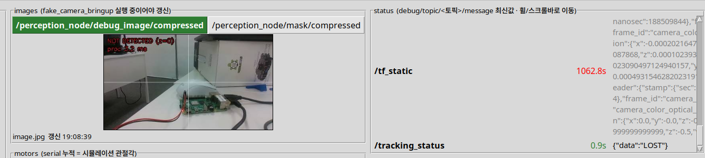

# 문제 2 — 인지·제어 노드 연결

## 기본 인터페이스

| 체&#8288;크 | 항목 | 규약 |
| :---: | --- | --- |
| ✅ | 목표 토픽 | /target · geometry_msgs/msg/PointStamped |
| ✅ | point.x / point.y | 정규화 중심 오차 ex / ey |
| ✅ | point.z | 면적비 · 0=미검출, 이때 x·y로 제어하지 않음 |
| ✅ | header.stamp | 원본 영상 시각 유지 · 촬영 시각을 모르면 영상 수신 시각임을 명시 |
| ✅ | 발행 | 영상 처리마다 발행 · 정상 영상의 미검출은 z=0 발행 |
| ✅ | QoS | best-effort, depth 1부터 적용 · 구독 측 호환 확인 |
| ✅ | 상태 | /tracking_status 등 팀이 정한 토픽과 상태 값 |
| ✅ | 모터 명령 | 위치/속도 방식, 단위·부호·주기·정지 명령 명시 |
| ✅ | 타임아웃 | 마지막 신선한 입력 수신 후 0.5초 기본 · 변경 이유 기록 ([영상](../../assets/통신실패_정지.mp4)) |

<video src="../../assets/통신실패_정지.mp4" controls width="600"></video>

## 구현 내용과 확인 입력

노드·연결 구조도와 인터페이스 표를 작성하고, **모터 출력을 끈 상태**에서 다음 입력을 확인합니다.

| 체&#8288;크 | 입력 | 기대 결과 |
| :---: | --- | --- |
| ✅ | x=0, z>0 | 중심에서 불필요한 회전 없음 |
| ✅ | x=+0.4, z>0 | 오른쪽 오차를 줄이는 명령 |
| ✅ | x=-0.4, z>0 | 반대 방향 명령 |
| ✅ | z=0 | 이전 목표를 계속 쫓지 않고 정지 |
| ✅ | 발행 중단 | 타임아웃 감지 후 정지 |

- ✅ 미검출과 통신 중단을 구분합니다.

  

- ✅ 카메라가 멈췄는데 이전 영상에 새 시각을 붙여 정상 입력처럼 보내면 안 됩니다.

## 결과물과 보고서

- ✅ 구조도·인터페이스 표·다섯 입력의 명령과 상태 로그를 제출합니다.
- ✅ 부호가 반대일 때의 현상, 미검출과 토픽 침묵의 차이, 노드별 책임을 설명합니다.
  - 설명: 부호가 반대일 때 좌우가 바뀝니다.
    - 미검출 = IDLE 상태
    - realsense2_camera -> raw_data 발행
    - perception_node -> raw_data 수신 및 /target 토픽 발행
    - dynamixel_move_node -> /target 토픽 수신 및 /motor_cmd, /tracking_status 발행
    - dynamixel_controller_node -> /motor_cmd 수신 및 opencr 시리얼 통신
