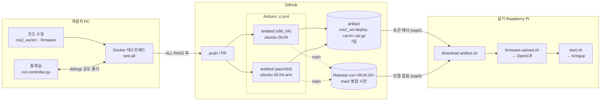
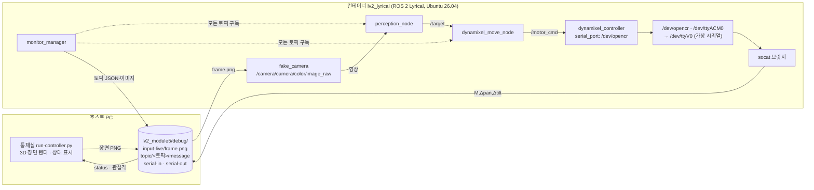
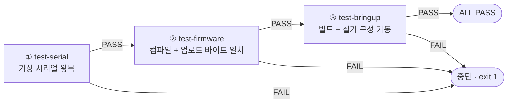
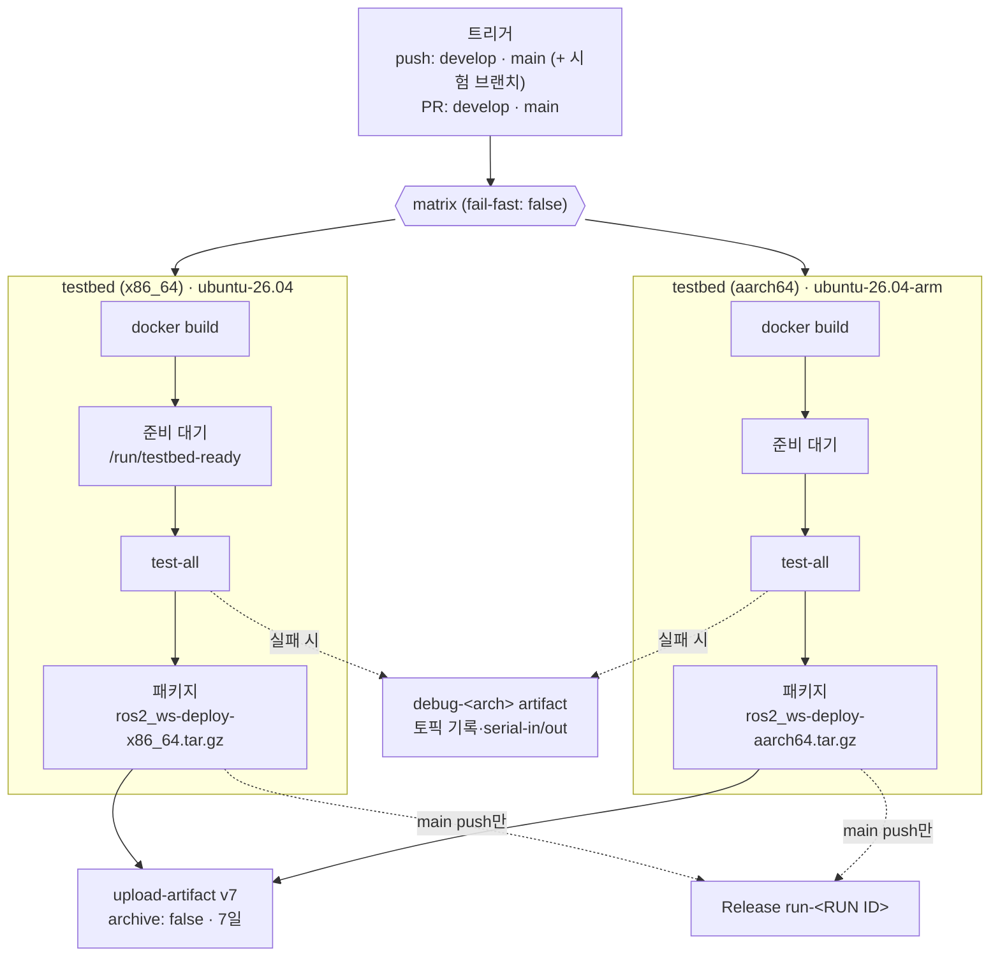
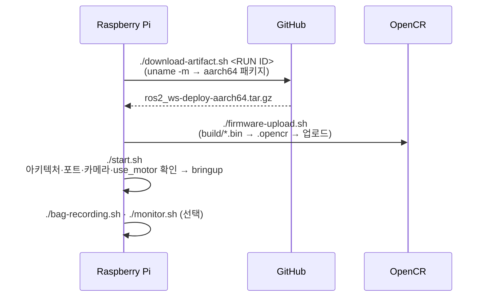

# devops — 테스트베드 · CI · 배포

실기(Raspberry Pi · RealSense · OpenCR · Dynamixel)는 한 대뿐이다. 4명이 장비 없이도 각자 코드를 검증하고, 검증된 결과만 실기에 올리기 위해 **Docker 테스트베드 → GitHub Actions(CI) → 배포 패키지 → 실기** 흐름을 만들었다.

| 구성 | 위치 | 역할 |
|---|---|---|
| 테스트베드 | [`docker/`](../docker/) | 실기와 같은 ROS 2 Lyrical 환경 + 가상 시리얼·더미 카메라 |
| 통제실 | [`docker/test-controller/run-controller.py`](../docker/test-controller/run-controller.py) | 3D 가상 카메라 장면 생성, 토픽·모터 상태 표시 (호스트에서 실행) |
| 검사 스크립트 | [`docker/test-*.sh`](../docker/) | 시리얼·펌웨어·bringup 자동 검사 (로컬과 CI가 같은 스크립트 사용) |
| CI | [`.github/workflows/ci.yml`](../.github/workflows/ci.yml) | push·PR마다 x86_64·aarch64에서 검사 → 배포 패키지 생성 |
| 실기 스크립트 | [`ros2_ws/*.sh`](ros2_ws/) | 패키지 받기·펌웨어 업로드·실행·기록·모니터링 |

> 요약: GitHub Actions 기반 **CI/CD 파이프라인**과 Docker 테스트베드의 **SIL(Software-in-the-Loop) 폐루프 시뮬레이션**으로 실기(**HIL**) 시험 전에 결함을 찾는다. URDF 기반 가상 카메라가 장면을 렌더링하고, 실기와 같은 인지·제어 노드가 가상 시리얼로 명령을 내보내 다시 카메라 자세에 반영된다.

### 용어

| 용어 | 뜻 | 이 프로젝트에서 |
|---|---|---|
| **CI** (Continuous Integration, 지속적 통합) | push·PR마다 빌드·테스트를 자동 실행해 문제 있는 코드가 합쳐지기 전에 잡음 | `ci.yml`이 `test-all` 실행 |
| **CD** (Continuous Delivery, 지속적 전달) | 테스트를 통과한 결과물을 바로 배포할 수 있는 형태로 자동 생성 | `ros2_ws-deploy-<arch>.tar.gz`, main 병합 시 Release |
| **CI/CD 파이프라인** | 위 둘을 이은 자동화 흐름 | [1. 전체 흐름](#1-전체-흐름) |
| **Matrix build** | 여러 환경(OS·아키텍처)에서 같은 테스트를 동시에 실행 | x86_64 + aarch64 |
| **Quality gate** | 통과해야 다음 단계로 가는 관문 | push 전 로컬 `test-all`, PR의 CI 통과 |
| **Shift-left testing** | 결함을 개발 과정의 앞쪽(실기 투입 전)에서 찾는 접근 | [5. 효과](#5-효과--실제로-잡은-문제) |
| **MIL** (Model-in-the-Loop) | 코드 대신 수식·모델로 알고리즘 검증 | (사용 안 함) |
| **SIL** (Software-in-the-Loop) | 하드웨어를 가상으로 대체하고 **실제 코드**를 그대로 돌려 검증 | Docker 테스트베드 + 통제실 — 카메라·시리얼·모터만 가상, 노드 코드는 실기와 동일 |
| **PIL** (Processor-in-the-Loop) | 실제 대상 CPU에서 코드 실행, 나머지는 가상 | Pi에서 노드 실행 + 가상 영상 입력 (선택 시험) |
| **HIL** (Hardware-in-the-Loop) | 실제 제어기·장치를 붙여 검증 | Raspberry Pi + RealSense + OpenCR + Dynamixel 실기 시험 ([report.md](report.md)) |
| **드라이 런** (Dry run, 드라이 테스트) | 실제 결과(부작용) 없이 동작만 미리 돌려 봄 — 장비 유무와 무관 | 실기에서 **모터 출력 끈 시험** (`use_motor:=false` — 노드는 다 돌고 모터 명령만 안 나감), `bag-replay.sh` 재처리. 장비 없는 가상 환경 검증은 SIL로 구분 |
| **폐루프(Closed-loop) 시뮬레이션** | 출력이 다시 입력에 영향을 주는 시뮬레이션 | 모터 명령 → 가상 관절각 → 카메라 장면이 바뀜 → 다시 인지 |
| **디지털 트윈** (Digital Twin) | 실제 기구를 본뜬 가상 모델 | `pan_tilt.urdf`로 pan·tilt 자세 계산 → 그 시점의 장면 렌더 |

검증 단계: **SIL(테스트베드·CI)** → (PIL) → **HIL(실기)**. SIL에서 통과한 코드만 실기에 올린다. SIL로 확인할 수 없는 부분은 [6. 한계](#6-한계).

## 1. 전체 흐름



1. 개발자가 테스트베드에서 `test-all`이 통과한 뒤 push한다.
2. CI가 같은 검사를 두 아키텍처에서 다시 돌리고, 통과하면 아키텍처별 배포 패키지를 올린다.
3. 실기에서 자기 아키텍처(aarch64) 패키지를 받아 펌웨어 업로드 → 실행한다.

## 2. 테스트베드

### 2.1 구성



닫힌 루프: 통제실이 장면을 그림 → `fake_camera`가 영상으로 발행 → 인지·제어 노드가 실기와 같은 코드로 동작 → 모터 명령이 가상 시리얼을 거쳐 `serial-out`에 쌓임 → 통제실이 그 명령을 누적해 카메라 자세를 바꿔 다시 그림. 기둥을 옮기면 카메라가 따라 돌아 기둥이 화면 가운데로 들어온다.

| 구성 요소 | 실기 | 테스트베드 |
|---|---|---|
| 카메라 | `realsense2_camera` | `fake_camera` (같은 토픽 이름 `/camera/camera/color/image_raw`) |
| 인지·제어 노드 | 같음 | 같음 (`bringup.launch.py use_camera:=false`) |
| OpenCR 시리얼 | `/dev/opencr` (udev → `/dev/ttyACM*`) | `/dev/opencr` → `/dev/ttyV0` (entrypoint가 링크) |
| 모터 | XM430 × 2 | 통제실이 명령을 누적해 관절각 추정 |

`dynamixel.yaml`의 포트(`/dev/opencr`)를 실기·테스트베드 모두 그대로 쓴다 — 설정을 바꾸지 않고 같은 코드가 양쪽에서 동작한다.

### 2.2 검사 스크립트

| 명령 (컨테이너 안) | 검사 내용 | PASS 조건 |
|---|---|---|
| `test-serial` | 가상 시리얼 브릿지 | 파일 → 시리얼 → 파일 왕복 |
| `test-firmware` | OpenCR 펌웨어 컴파일·업로드 | 업로드된 바이트(`serial-out`)가 `.bin`과 동일 |
| `test-bringup` | colcon 빌드 + 실기 구성 bringup | 실기 노드 전부 기동 + 토픽 기록 |
| **`test-all`** | 위 3개를 순서대로 | 모두 PASS → `ALL PASS` (push 전 로컬 게이트, CI도 이것만 실행) |
| `test-fake_camera_bringup` | 더미 영상 → 인지 → `/target` | `/target` 수신 (통제실과 함께 사람이 돌림 — `test-all`에 포함 안 함) |
| `test-logger` | 떠 있는 토픽을 `debug/topic/`에 기록 | — (보조 도구) |

```bash
cd docker
docker compose up -d --build
docker compose exec lyrical test-all                    # push 전에
docker compose exec lyrical test-fake_camera_bringup 0  # 통제실과 함께 닫힌 루프 확인
```

### 2.3 `test-all` 상세

push 전 로컬과 CI가 똑같이 실행하는 검사 묶음이다 ([`docker/test-all.sh`](../docker/test-all.sh)). 세 단계를 순서대로 돌리고, **하나라도 FAIL이면 그 자리에서 멈춘다** (exit 1 → CI 잡 실패).



| 단계 | 하는 일 | PASS 조건 | 이런 문제를 잡는다 |
|---|---|---|---|
| ① `test-serial` | `serial-in` 파일에 쓴 토큰이 `/dev/ttyV0`에서 읽히는지, `/dev/ttyV0`에 쓴 토큰이 `serial-out`에 쌓이는지 확인 | 양방향 왕복 성공 | 가상 시리얼 브릿지(socat) 미구동, 컨테이너 준비 전 검사 시작 |
| ② `test-firmware` | `firmware/` 아래 모든 스케치를 `arduino-cli`로 컴파일 → 결과 `.bin`을 가상 시리얼로 업로드 | 업로드된 바이트(`serial-out`)가 `.bin`과 바이트 단위로 같음 | 펌웨어 컴파일 오류, 툴체인 문제(예: x86 i386 툴체인), 업로드 경로 오류 |
| ③ `test-bringup` | `colcon build` → 실기와 같은 구성으로 `bringup.launch.py` 실행 → 8초 대기하며 `test-logger`로 토픽 기록 → 정상 종료 | 노드 4개(`/camera/camera` `/perception_node` `/dynamixel_move_node` `/dynamixel_controller`)가 모두 뜨고 토픽 기록이 1개 이상 | C++ 빌드 오류, 의존성 누락, launch 파일 오류(인자·경로), 노드가 시작하다 죽는 문제(파라미터 오류 등) |

결과물: ②의 컴파일 결과(`debug/firmware/<스케치>/*.bin`)는 CI 배포 패키지의 펌웨어로, ③의 빌드 결과(`install/`)는 배포 패키지의 ROS 2 패키지로 그대로 쓰인다. 즉 **배포 패키지에는 `test-all`을 통과한 산출물만 들어간다.**

`test-all`이 확인하지 **않는** 것:

- 인지 → 제어 → 시리얼로 이어지는 데이터 흐름: ③은 노드가 "뜨는지"만 본다 (컨테이너엔 실제 카메라가 없어 영상이 안 나옴). 닫힌 루프는 `test-fake_camera_bringup` + 통제실로 사람이 확인한다.
- 단위 테스트(gtest `test_detector` 등): `colcon test`는 실행하지 않는다. 필요하면 `docker compose exec lyrical bash -c "cd /ws && colcon test && colcon test-result --verbose"`.
- 실제 장비 동작: [6. 한계](#6-한계).

## 3. CI (GitHub Actions)



| 항목 | 내용 | 이유 |
|---|---|---|
| 같은 검사 | 로컬 `test-all`과 CI가 같은 `docker/test-*.sh` 실행 | 검사 로직이 한 곳에만 있음 → 로컬 통과 = CI 통과 |
| 두 아키텍처 | x86_64·aarch64 러너에서 각각 네이티브 빌드 | `install/` 실행 파일은 빌드한 CPU에서만 실행됨 (x86 빌드를 Pi에서 돌리면 `Exec format error`) |
| 준비 대기 | `/run/testbed-ready`가 생길 때까지 대기 | `docker run -d`는 entrypoint(가상 시리얼 준비)를 기다리지 않음 |
| 패키지 | tar.gz 하나, 최상위 폴더 없음 | zip은 실행 권한을 잃음 · `archive: false`로 이중 압축 방지 |
| Release | main 병합 때만 | 시험 실행마다 Release가 쌓이지 않게. Release는 인증 없이 wget 가능 |
| 제출 태그 `lv2-module5-submit` | main 병합 때만 (x86_64 잡, 검사 통과 후) | 마지막 main 병합 커밋 = 제출본. 다시 병합하면 태그를 새 커밋으로 옮김 → 최종 커밋에 `run-<RUN ID>`·`lv2-module5-submit` 두 태그 |
| debug | 실패했을 때만 올림 | 원격 실패 원인을 볼 유일한 근거 |

### 3.1 배포 패키지 구성

```
ros2_ws-deploy-<arch>.tar.gz   (풀면 바로 아래 내용)
├── install/                         ROS 2 패키지 (이 아키텍처용, 심볼릭 링크 없이 실제 파일)
├── firmware/
│   ├── opencr_pan_tilt/             스케치 소스
│   ├── upload.sh, README.md
│   └── build/opencr_pan_tilt/opencr_pan_tilt.ino.bin   CI가 컴파일한 펌웨어 (OpenCR용, 아키텍처 무관)
├── start.sh · firmware-upload.sh · bag-recording.sh · bag-replay.sh · monitor.sh · download-artifact.sh
└── ARCH                             x86_64 또는 aarch64
```

## 4. 실기 배포



| 스크립트 | 하는 일 | 실기 안전장치 |
|---|---|---|
| `download-artifact.sh` | RUN ID로 패키지 받기 (토큰 헤더 또는 Release, wget만 사용) | 장치 아키텍처에 맞는 파일 선택 · 비어 있지 않은 폴더 덮어쓰기 거부 |
| `firmware-upload.sh` | `.bin` → `.opencr` 변환 후 OpenCR 업로드 | `dynamixel_controller` 실행 중이면 거부 · 120초 제한 |
| `start.sh` | 장치 확인 후 bringup | install 아키텍처 불일치 차단 · `use_motor:=false`가 적용 안 되는 launch면 차단 |
| `bag-recording.sh` | 토픽 묶음 기록 + 정보·해시 | 디스크 부족 시 시작 안 함 · `-z` 압축 |
| `bag-replay.sh` | 재생·입력 재처리 | `dynamixel_controller` 실행 중이면 재생 거부 (모터 오작동 방지) |
| `monitor.sh` | `monitor_manager`로 토픽을 `debug/topic/`에 저장 (통제실이 실기 상태 표시) | 원본 영상 기본 제외 · sudo 실행 경고 |

## 5. 효과 — 실제로 잡은 문제

테스트베드·CI가 실기에 올리기 전에 찾아낸 문제들이다. 실기에서 처음 발견했다면 원인을 좁히는 데 장비와 시간을 썼을 것들이다.

| 발견 경로 | 문제 | 원인 | 조치 |
|---|---|---|---|
| `test-firmware` (x86 테스트베드) | 펌웨어 컴파일 실패 `fork/exec arm-none-eabi-g++: no such file` | 공식 OpenCR 툴체인이 32비트(i386) 바이너리 — 64비트 이미지에서 실행 불가. arm64(Mac)에선 다른 설치 경로라 드러나지 않음 | Dockerfile: x86에서도 시스템 `arm-none-eabi-gcc` 사용 |
| 테스트베드 실행 | 모터 명령이 `serial-out`에 안 쌓임 | `dynamixel.yaml`이 `/dev/opencr`로 바뀌었는데 테스트베드엔 그 장치가 없음 | `entrypoint.sh`가 `/dev/opencr`도 가상 시리얼로 연결 (팀 코드 수정 없이) |
| CI 첫 실행 | `Invalid container name (t)` | Docker 이름은 최소 2자 | 컨테이너 이름 `testbed` |
| CI | `test-serial` FAIL `/dev/ttyV0 없음` | `docker run -d` 직후 entrypoint 준비 전에 검사 시작 (로컬은 사람이 늦게 실행해 드러나지 않음) | 준비 완료 표시 파일 + CI 대기 |
| 실기 | `Exec format error` | x86 CI 빌드를 Pi(aarch64)에서 실행 | aarch64 러너 추가, `start.sh` 아키텍처 검사 |
| 테스트베드 실행 | `use_motor:=false`인데 `dynamixel_controller`가 뜸 | `dynamixel.launch.py`가 인자를 처리하지 않음 | `start.sh`가 차단 (담당자 수정 필요) |
| 통제실 (Linux) | 드래그가 항상 회전, 휠 줌 안 됨 | X11 Tk의 `Option`=NumLock, 휠=Button-4/5 (macOS와 다름) | OS별 처리 |

## 6. 한계

테스트베드·CI가 검증하지 **못하는** 것 — 실기에서 따로 확인한다 ([README 11장](README.md#11-실기raspberry-pi-문제-해결), [report.md](report.md)).

- 실제 모터 동작: 방향·속도·범위·정지 (테스트베드는 명령을 누적한 **추정** 관절각)
- 실제 카메라: 조명·노출·지연·FPS (fake_camera는 렌더된 장면)
- Pi 성능: CPU·SD카드 쓰기 속도에 따른 FPS·bag 기록 누락
- 네트워크: PC↔Pi DDS 발견, Wi-Fi 멀티캐스트 차단
- OpenCR 실제 업로드: CI는 가상 시리얼에 바이트 전송까지만 확인 (부트로더 응답은 실기에서만)
- `test-fake_camera_bringup`(닫힌 루프)은 사람이 통제실과 함께 돌리는 검사라 CI에 포함되지 않음
