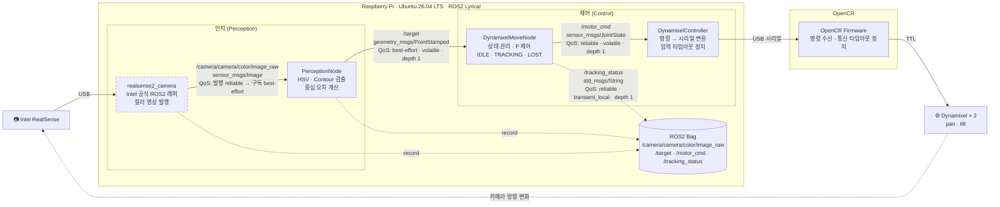

# 최종 보고서 — 비전 객체 추적 시스템

## 시스템 구성
### 구조도



점선 테두리는 외부 패키지(직접 구현하지 않는 노드)입니다.

### 노드

| 구분 | 노드 | 역할 | 구독 | 발행 |
|---|---|---|---|---|
| 인지 | `realsense2_camera` (외부 패키지) | RealSense 컬러 영상 발행 (Intel 공식 ROS2 래퍼) | — (USB 카메라) | `/camera/camera/color/image_raw` |
| 인지 | `PerceptionNode` | HSV·Contour 검출, 정규화 중심 오차·면적비 계산 | `/camera/camera/color/image_raw` | `/target` |
| 제어 | `DynamixelMoveNode` | 상태 전이(IDLE·TRACKING·LOST), P 제어, 속도·범위·데드밴드 제한 | `/target` | `/motor_cmd`, `/tracking_status` |
| 제어 | `DynamixelController` | 모터 2개(pan·tilt) 명령을 OpenCR 시리얼 프로토콜로 변환·전송, 입력 타임아웃 시 정지 명령 | `/motor_cmd` | — (USB 시리얼) |
| 펌웨어 | OpenCR Firmware | 시리얼 명령 수신 → Dynamixel 구동, 통신 타임아웃 시 정지 | — (USB 시리얼) | — (Dynamixel) |

#### 토픽 정의

| 토픽 | 이름 근거 | 메시지 타입 | 발행 → 구독 | QoS |
|---|---|---|---|---|
| `/camera/camera/color/image_raw` | realsense2_camera 기본 | `sensor_msgs/msg/Image` | realsense2_camera → PerceptionNode | 발행: reliable · volatile (드라이버 기본) / 구독: best-effort · volatile · depth 1 |
| `/target` | 과제 규약 | `geometry_msgs/msg/PointStamped` | PerceptionNode → DynamixelMoveNode | best-effort · volatile · depth 1 |
| `/motor_cmd` | 팀 정의 | `sensor_msgs/msg/JointState` | DynamixelMoveNode → DynamixelController | reliable · volatile · depth 1 |
| `/tracking_status` | 과제 예시 | `std_msgs/msg/String` | DynamixelMoveNode → (모니터링·bag) | reliable · transient_local · depth 1 |

- PerceptionNode는 코드에서 `/image_raw`를 구독하고, launch에서 `/image_raw:=/camera/camera/color/image_raw`로 remap합니다 (`image_topic` 인자).
- DynamixelController → OpenCR 구간은 토픽이 아닌 USB 시리얼(`MotorSerialCommand`, 커스텀)입니다.
- 타임아웃: 마지막으로 신선한 입력을 받은 뒤 0.5초가 지나면 정지합니다. DynamixelMoveNode는 `/target`, DynamixelController는 `/motor_cmd`, OpenCR은 시리얼 명령 기준으로 각각 판단합니다.

##### QoS 범례

| 정책 | 값 | 의미 | 사용 토픽 |
|---|---|---|---|
| Reliability | `best-effort` | 유실된 메시지를 재전송하지 않음. 지연이 작고 최신 데이터가 중요한 센서 데이터에 사용 | 카메라 영상 구독(PerceptionNode), `/target` |
| Reliability | `reliable` | 유실 시 재전송하여 전달을 보장 | 카메라 영상 발행(realsense2_camera 기본), `/motor_cmd`, `/tracking_status` |
| Durability | `volatile` | 구독 이후에 발행된 메시지만 받음 (기본값) | 카메라 영상, `/target`, `/motor_cmd` |
| Durability | `transient_local` | 발행자가 마지막 메시지를 보관하여, 나중에 접속한 구독자도 즉시 받음 | `/tracking_status` |
| History | `keep_last` · `depth N` | 최근 N개만 큐에 보관. `depth 1`은 오래된 메시지를 버리고 최신 것만 유지 | 전체 |

- 호환성: 발행 측이 `best-effort`이면 구독 측이 `reliable`일 때 연결되지 않습니다. 발행 측이 `volatile`이면 구독 측이 `transient_local`일 때 연결되지 않습니다. 구독 측은 발행 측과 같거나 더 약한 정책을 사용합니다.
- `/tracking_status`는 상태가 바뀔 때마다, 그리고 1Hz 주기로 발행합니다. `transient_local`이므로 `ros2 topic echo`나 bag 기록을 나중에 시작해도 현재 상태를 바로 받습니다.


#### 메시지 구조

- 🟦 **ROS2 제공**: ROS2(Lyrical)에 포함된 표준 메시지입니다. 별도 정의 없이 사용합니다.
- 🟧 **커스텀**: 팀이 직접 정의하는 메시지·프로토콜입니다.
- 모든 ROS2 토픽은 ROS2 제공 메시지를 사용하므로 커스텀 메시지 패키지는 두지 않습니다. 커스텀은 OpenCR 시리얼 프로토콜뿐입니다.

##### 사용 메시지 타입 목록

| 메시지 타입 | 구분 | 패키지 | 사용 위치 |
|---|---|---|---|
| `sensor_msgs/msg/Image` | 🟦 ROS2 제공 | `sensor_msgs` | `/camera/camera/color/image_raw` |
| `geometry_msgs/msg/PointStamped` | 🟦 ROS2 제공 | `geometry_msgs` | `/target` |
| `geometry_msgs/msg/Point` | 🟦 ROS2 제공 | `geometry_msgs` | `PointStamped.point` |
| `sensor_msgs/msg/JointState` | 🟦 ROS2 제공 | `sensor_msgs` | `/motor_cmd` |
| `std_msgs/msg/String` | 🟦 ROS2 제공 | `std_msgs` | `/tracking_status` |
| `std_msgs/msg/Header` | 🟦 ROS2 제공 | `std_msgs` | `Image`·`PointStamped`·`JointState`의 `header` |
| `builtin_interfaces/msg/Time` | 🟦 ROS2 제공 | `builtin_interfaces` | `Header.stamp` |
| `MotorSerialCommand` | 🟧 커스텀 | `firmware/` (ROS2 메시지 아님) | DynamixelController → OpenCR USB 시리얼 |

##### `sensor_msgs/msg/Image` — 🟦 ROS2 제공

```
std_msgs/Header header    # stamp: realsense2_camera가 넣는 프레임 시각 (촬영 시각 기준 여부는 검증 후 기록)
                          # frame_id: "camera_color_optical_frame"
uint32  height            # 영상 높이 [px]
uint32  width             # 영상 너비 [px]
string  encoding          # "rgb8" (realsense2_camera 컬러 기본) → PerceptionNode에서 BGR로 변환
uint8   is_bigendian
uint32  step              # 한 행의 바이트 수 (width × 3)
uint8[] data              # 픽셀 데이터
```

##### `geometry_msgs/msg/PointStamped` — 🟦 ROS2 제공

```
std_msgs/Header header    # stamp: 원본 영상 시각 유지 (입력 영상의 stamp 복사)
geometry_msgs/Point point # 아래 Point 참고
```

> 이 과제의 목표 정보 전달 규약이며, 일반적인 3차원 위치로 해석하지 않습니다.
> 정상 영상에서 미검출이면 `z = 0`으로 발행합니다. 발행 중단(토픽 침묵)은 미검출과 구분하여 타임아웃으로 처리합니다.

##### `geometry_msgs/msg/Point` — 🟦 ROS2 제공

```
float64 x                 # ex = (cx − W/2) / (W/2), −1 ~ +1, 오른쪽 +
float64 y                 # ey = (cy − H/2) / (H/2), −1 ~ +1, 아래쪽 +
float64 z                 # 면적비 = contour_area / (W × H), 0 = 미검출 (이때 x·y는 사용하지 않음)
```

##### `sensor_msgs/msg/JointState` — 🟦 ROS2 제공

```
std_msgs/Header header    # stamp: 명령 생성 시각
string[]  name            # ["pan", "tilt"]
float64[] position        # 사용하지 않음 (빈 배열)
float64[] velocity        # 각 축 속도 명령 [rad/s], name과 같은 순서, 0 = 정지
float64[] effort          # 사용하지 않음 (빈 배열)
```

> 원래 관절 상태 보고용 타입이지만, 이 프로젝트에서는 모터 속도 명령 용도로 사용합니다.
> 기본 구현(수평 1축)에서는 `tilt` 속도를 항상 0으로 보냅니다.

##### `std_msgs/msg/String` — 🟦 ROS2 제공

```
string data               # "IDLE" | "TRACKING" | "LOST"
```

##### `std_msgs/msg/Header` — 🟦 ROS2 제공

```
builtin_interfaces/Time stamp   # 아래 Time 참고
string frame_id                 # 좌표계 이름 (예: "camera_color_optical_frame")
```

##### `builtin_interfaces/msg/Time` — 🟦 ROS2 제공

```
int32  sec                # 초
uint32 nanosec            # 나노초
```


# 발표 자료 — 비전 객체 추적 시스템

PDF 발표 흐름: **구조 → 정상 추적 → 소실·복귀 → 정량 결과 → 재현·기여 → 한계** (5분 시연)

## 평가 및 최종 시연 안내

| 체&#8288;크 | 순서 | 시간 | 내용 |
| :---: | --- | --- | --- |
| ⬜ | 목표와 구성 | 30초 | 대상·장비·노드 연결 |
| ✅ | 정상 추적 | 1분 | 좌우 이동과 응답 ([영상](assets/추적.mp4)) |
| ✅ | 소실·복귀 | 1분 | 가림 시 정지, 시야 내 재등장 복귀 ([영상](assets/성공및손실복귀.mp4)) |
| ✅ | 정량 결과 | 1분 | Kp 비교, FPS·검출률·RMSE·복구 |
| ✅ | 재현·협업 | 1분 | bag 재처리, 실행 확인, 4인 기여 |
| ✅ | 한계 | 30초 | 실패 조건과 개선 방향 |

## 1. 팀 소개

| 이름 | 역할 |
|---|---|
| 김현하 | 팀장 · 테크 리드 · 문서 통합 · 테스트베드 |
| 정구영 | 통합 (ROS2 인터페이스·실행 구성·bag 재현) |
| 심규진 | 제어 (OpenCR·다이나믹셀·P 제어·안전 정지) |
| 문태영 | 인지 (HSV·Contour 검출·중심 오차) |

## 2. 시스템 구조

```
RealSense D435 → perception_node ─/target─▶ dynamixel_move_node ─/motor_cmd─▶ dynamixel_controller
                 (HSV·Contour)    (ex,ey,면적비)  (IDLE/TRACKING/LOST)   (Δrad)    ─"M,Δpan,Δtilt"─▶ OpenCR → XM430 ×2
```

- 인터페이스 표: [문제 2](문제/문제2/README.md)
- 핵심 규약: z = 0 미검출 / 원본 영상 시각 유지 / 입력 0.5초 타임아웃 → LOST

## 3. 5분 시연 순서

| 순서 | 시간 | 시연 내용 | 담당 | 확인 포인트 |
|---|---|---|---|---|
| 1 | 0:00~0:40 | 구조·인터페이스 한 장 | 김현하 | 노드 책임 분리, `/target` 규약 |
| 2 | 0:40~1:40 | 정상 추적: 목표를 좌→중→우로 이동 | 심규진 | 오차가 줄어드는 방향으로 회전, 중앙 데드밴드에서 정지 |
| 3 | 1:40~2:40 | 소실·복귀: 약 2초 가림 → 재등장 | 문태영 | 가림 즉시 정지, LOST → 재등장 후 TRACKING |
| 4 | 2:40~3:20 | 통신 중단: `/target` 중단, 제어 프로그램 종료 | 정구영 | 0.5초 타임아웃 정지, OpenCR 측 정지 (TODO: 펌웨어 타임아웃 구현 후) |
| 5 | 3:20~4:20 | 정량 결과 + bag 재현 | 정구영·김현하 | FPS·검출률·RMSE·복구율, `/target_replay` 재처리 |
| 6 | 4:20~5:00 | 기여·한계 | 김현하 | PR·리뷰, 미완료 항목 |

TODO(팀): 리허설 후 시간·담당 조정

## 4. 핵심 결과

### 4.1 검출

TODO(인지): 정상·없음·가림 3장면 이미지, 검출률 / 배경 오검출 ([문제 1](문제/문제1/README.md))

### 4.2 추적 (Kp 비교)

TODO(제어): Kp 2종 × 3회 오차 그래프, 최종 Kp 선택 근거 ([문제 3](문제/문제3/README.md))

### 4.3 안전 정지·복구

TODO(검증): 복구 5회 표, 입력·통신 중단 결과 ([문제 4](문제/문제4/README.md))

### 4.4 재현

TODO(통합): bag 재처리 결과, 다른 팀원 실행 기록 ([문제 5](문제/문제5/README.md))

## 5. 설계 판단

- **영상 구독은 reliable**: best-effort로 받으면 큰 영상 조각 손실로 1~2fps → reliable 30fps (인지 실측, [perception_env_record.md](results/perception_env_record.md)). `/target`은 규약대로 best-effort.
- **위치 변화량 제어 + 펌웨어 범위 제한**: 펌웨어가 목표각을 누적하고 −180~179.9°로 제한. TODO(제어): 속도형 대신 위치형을 고른 이유
- **실기 없이 검증하는 테스트베드**: Docker + 가상 시리얼 + 3D 닫힌 루프 시뮬레이션으로 인터페이스·상태 전이를 먼저 확인 (대체 환경 — 최종 수치는 실기)
- TODO(팀): 상태 토픽 주기, 3프레임 복귀 조건 결정

## 6. 한계와 개선 방향

- TODO: 측정 후 정리 ([report.md](report.md))
- 현재 확인된 항목: OpenCR 통신 타임아웃 미구현, 프레임당 변화량(dt 미사용), 복귀 1프레임, URDF 치수 추정값

## 7. 시연 실패 대비 (백업 자료)

- 사전 녹화 영상: TODO ([recordings/README.md](recordings/README.md)에 위치)
- 대표 bag 재생: `ros2 bag play …` (TODO: 명령)
- 실기 고장 시: 테스트베드 3D 시뮬레이션으로 같은 시나리오 시연 (대체 환경임을 명시)
