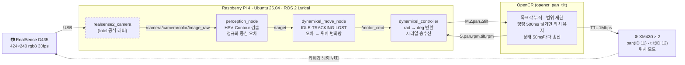
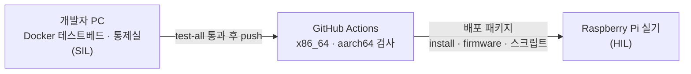

# 발표 자료 — 비전 객체 추적 시스템

> 카메라로 파란 사각 기둥을 찾고, 화면 중심과의 오차만큼 pan·tilt 모터를 돌려 따라간다.
> 목표가 사라지거나 통신이 끊기면 멈추고, 다시 보이면 복귀한다.
> 상세: [README.md](README.md) (실행·재현) · [report.md](report.md) (문제별 결과) · [devops.md](devops.md) (테스트베드·CI)

## 시스템 구성

### 구조도

점선 테두리는 외부 패키지(직접 구현하지 않음). 실행: `ros2 launch bringup bringup.launch.py` (`realsense.launch.py` + `dynamixel.launch.py`)

### 노드

| 구분 | 노드 | 역할 | 구독 | 발행 |
|---|---|---|---|---|
| 인지 | `realsense2_camera` (외부) | 컬러 영상 424×240 rgb8 30fps | — (USB) | `/camera/camera/color/image_raw` |
| 인지 | `perception_node` | HSV 마스크 → 잡음 제거 → 컨투어 → 후보 필터 → 대상 선택 → 중심 계산 | 카메라 영상 | `/target`, 디버그·마스크 영상 |
| 제어 | `dynamixel_move_node` | 상태 머신, 오차 → 위치 변화량 명령 (데드밴드·상한) | `/target` | `/motor_cmd`, `/tracking_status` |
| 제어 | `dynamixel_controller` | 변화량을 시리얼 명령으로, 펌웨어 상태를 토픽으로 | `/motor_cmd` | `/joint_states`, `/opencr/serial_rx`, `/opencr/serial_tx` |
| 펌웨어 | `opencr_pan_tilt` | 목표각 누적·범위 제한(−180~179.9°), watchdog, 상태 송신 | 시리얼 `M` | 시리얼 `S` |

### 토픽

| 토픽 | 메시지 타입 | 발행 → 구독 | QoS |
|---|---|---|---|
| `/camera/camera/color/image_raw` | `sensor_msgs/Image` | realsense2_camera → perception_node | 구독 reliable · depth 1 |
| `/target` | `geometry_msgs/PointStamped` | perception_node → dynamixel_move_node | best-effort · volatile · depth 1 |
| `/motor_cmd` | `sensor_msgs/JointState` | dynamixel_move_node → dynamixel_controller | reliable · volatile · depth 1 |
| `/tracking_status` | `std_msgs/String` | dynamixel_move_node → (모니터링·bag) | reliable · **transient_local** · depth 1 |
| `/joint_states` | `sensor_msgs/JointState` | dynamixel_controller → (모니터링·bag) | reliable · depth 10 |
| `/opencr/serial_rx` · `/opencr/serial_tx` | `std_msgs/String` | dynamixel_controller → (디버그) | reliable · depth 50 |
| `/perception_node/debug_image/compressed` · `mask/compressed` | `sensor_msgs/CompressedImage` | perception_node → (모니터링) | reliable · depth 1 |

- 모든 토픽은 ROS 2 표준 메시지를 쓴다. 커스텀은 OpenCR 시리얼 프로토콜뿐이다.
- 영상 구독을 reliable로 둔 이유: 큰 영상 메시지는 best-effort에서 조각이 유실돼 1~2fps만 받았고, reliable에서 30fps를 받았다 (개발 PC 실측, [perception_env_record.md](results/perception_env_record.md)).
- `/tracking_status`는 상태가 바뀔 때 + 1초마다 발행. transient_local이라 나중에 붙은 구독자도 현재 상태를 바로 받는다.

### 메시지 규약

| 대상 | 필드 | 의미 |
|---|---|---|
| `/target` | `point.x` / `point.y` | 정규화 중심 오차 ex = (cx − W/2)/(W/2), ey = (cy − H/2)/(H/2) · 오른쪽·아래 + · −1~+1 |
| | `point.z` | 면적비 contour_area/(W×H) · **0 = 미검출** (이때 x·y로 제어하지 않음) |
| | `header.stamp` | 원본 영상 시각 그대로 |
| `/motor_cmd` | `name` | `[pan_joint, tilt_joint]` |
| | `position` | **이번에 움직일 변화량 [rad]** (속도가 아님) · 데드밴드 안이면 발행 안 함 |
| `/joint_states` | `position` / `velocity` | 펌웨어가 읽은 **실제 모터 위치 [rad]·속도 [rad/s]** (명령 누적 추정이 아님) |
| `/tracking_status` | `data` | `IDLE` · `TRACKING` · `LOST` |
| 시리얼 (앱 → OpenCR) | `M,<Δpan>,<Δtilt>\n` | 변화량 [deg], 115200bps |
| 시리얼 (OpenCR → 앱) | `S,<pan>,<pan_rpm>,<tilt>,<tilt_rpm>\n` | 현재 위치 [deg, 180° 중심 기준]·속도 [rpm], 50ms마다 |

제어식 (`/target` 1개마다): `Δpan = clamp(pan_gain × ex, ±max_pan_command)` (|ex| ≤ 데드밴드면 0). tilt도 같은 형태.

| 파라미터 | 값 |
|---|---|
| `pan_gain` / `tilt_gain` | −0.03 / 0.06 rad per 정규화 오차 |
| `max_pan_command` / `max_tilt_command` | 0.0873 rad (5°) per 프레임 |
| `horizontal_deadband` / `vertical_deadband` | 0.05 |
| `lost_timeout` | 0.5 s |

### 상태와 정지

| 상황 | 감지 | 동작 |
|---|---|---|
| 시작 | — | `IDLE`, 명령 없음 |
| 유효한 목표 수신 (z > 0) | dynamixel_move_node | `TRACKING`, 오차만큼 변화량 명령 |
| 미검출 (z = 0) | dynamixel_move_node | 명령을 보내지 않음 → 위치 모드라 그 자리에 정지. 마지막 유효 목표 후 0.5초 지나면 `LOST` |
| 인지 입력 중단 (`/target` 침묵) | dynamixel_move_node (50ms마다 확인) | 0.5초 후 `LOST`, 명령 없음 |
| 제어 통신 중단 (컨트롤러 종료·USB 단절) | OpenCR watchdog | 명령 500ms 미수신 → **현재 위치에서 정지** |
| 목표 재등장 | dynamixel_move_node | 유효 목표 1개로 `TRACKING` 복귀 |

> 위치 모드는 "명령을 멈추면 멈춘다"를 가정하지 않고, 펌웨어가 현재 위치를 목표로 다시 지정해 실제로 세운다.

## 개발·검증 환경 (테스트베드 · CI/CD)

> 상세: [devops.md](devops.md) — 다이어그램, 검사 단계, 배포 패키지, 실제로 잡은 문제, 한계

실기(Pi·RealSense·OpenCR·Dynamixel)가 한 대뿐이라, 장비 없이 4명이 각자 검증하고 통과한 코드만 실기에 올리는 흐름을 만들었습니다.

| 단계 | 하는 일 | 근거 |
|---|---|---|
| **SIL** (Software-in-the-Loop) | 가상 카메라 장면 → 실제와 같은 인지·제어 노드 → 가상 시리얼 → 가상 관절각 → 다시 장면 (폐루프) | [devops.md 2](devops.md#2-테스트베드) |
| **CI** | push·PR마다 `test-all` (시리얼 · 펌웨어 컴파일·업로드 · bringup) 자동 실행 | [devops.md 2.3](devops.md#23-test-all-상세) |
| **CD** | 아키텍처별 배포 패키지 생성, main 병합 시 Release | [devops.md 3](devops.md#3-ci-github-actions) |
| **HIL** | 실기에서 패키지 받기 → 펌웨어 업로드 → `start.sh` | [devops.md 4](devops.md#4-실기-배포) |

**효과 — 실기 투입 전에 잡은 문제** ([devops.md 5](devops.md#5-효과--실제로-잡은-문제))

- x86 Docker에서 펌웨어 컴파일 실패 (32비트 툴체인) → 시스템 컴파일러로 교체
- 테스트베드에 `/dev/opencr`가 없어 모터 명령이 안 나감 → 가상 시리얼 링크 추가
- Pi에서 `Exec format error` (x86 빌드) → aarch64 빌드 추가, 실행 전 아키텍처 검사
- `use_motor:=false`가 모터를 끄지 않음 → 실행 스크립트에서 차단

**한계**: 실제 모터 동작·카메라 조건·Pi 성능·네트워크는 실기(HIL)에서만 확인 가능 ([devops.md 6](devops.md#6-한계))
