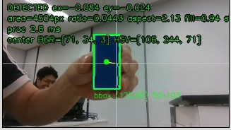
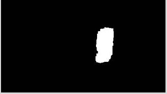

# 문제 1 — HSV·Contour 검출 파이프라인

## 구현 내용

- [x] 1. 배경과 구분되는 단일 색상 목표 1개를 선정하고 사진을 남깁니다.

  | 검출 | 마스크 |
  | :---: | :---: |
  |  |  |

- [x] 2. 영상 → HSV 변환 → 색상 마스크 → 잡음 제거 → 컨투어 → 대상 선택 → 중심 계산을 구현합니다.
- [x] 3. HSV 범위·최소 면적·해상도를 설정 파일로 분리하고 여러 후보 중 선택 규칙을 정합니다.
- [x] 4. 원본 위에 컨투어·목표 중심·영상 중심을 표시합니다. 미검출 때 이전 좌표를 새 목표로 재사용하지 않습니다.
- [x] 5. 목표가 잘 보이는 장면·없는 장면·일부 가려진 장면을 같은 설정으로 확인합니다.

> - 정규화 오차는 ex=(cx-W/2)/(W/2), ey=(cy-H/2)/(H/2)입니다.
> - 오른쪽·아래쪽을 양수로 정하며, W·H는 실제 프레임 크기입니다.
> - 면적비는 contour_area/(W×H)입니다.

## 결과물과 보고서

- [x] 세 장면의 원본·마스크·검출 이미지, 실제 설정, 검출·미검출 기록을 제출합니다.
- [x] HSV 범위를 정한 근거, 배경 오검출을 줄인 조건, 미검출 전달 방식을 설명합니다.
