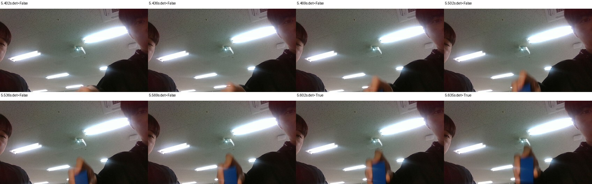
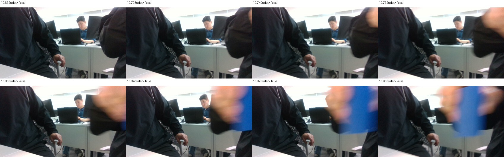
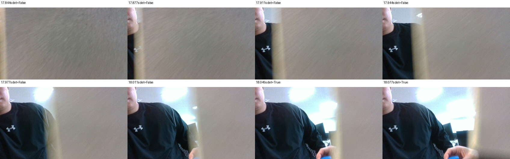
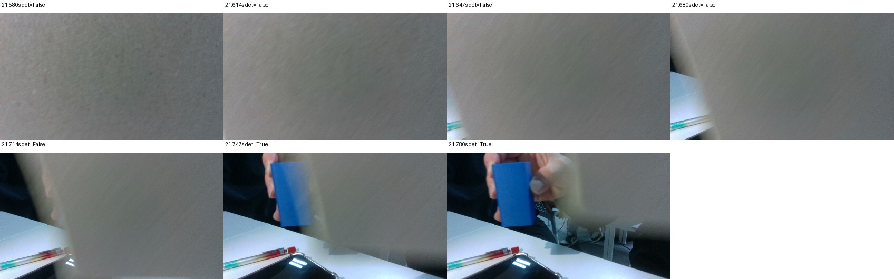
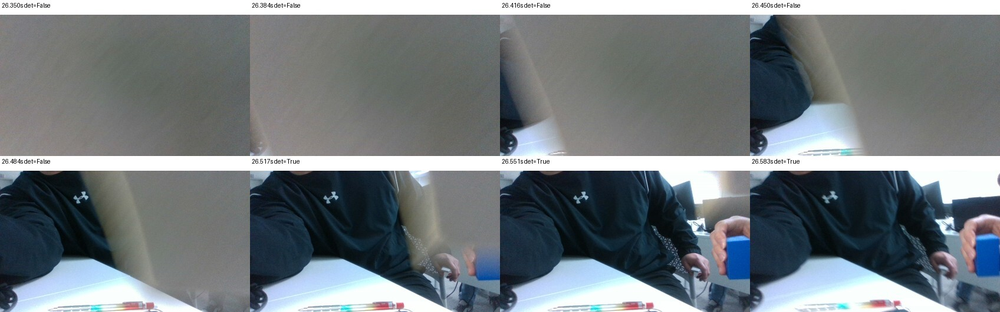

# 문제 5 — bag 재현과 팀 협업

## 구현 내용

- ✅ 1. 대표 성공 장면과 소실·복귀 장면을 각각 10~30초 수준으로 기록하고 용량을 확인합니다.

  <video src="../../assets/성공및손실복귀.mp4" controls width="600"></video>

  영상: [성공및손실복귀.mp4](../../assets/성공및손실복귀.mp4)

- ✅ 2. 영상·목표·상태·명령 토픽을 기록합니다. 시리얼 로그는 같은 실행 ID로 연결합니다. ([echo](../../recordings/echo/))
- ✅ 3. bag의 토픽·메시지 수·기간·해상도·설정·기준 커밋을 남깁니다. 저장 형식에 맞는 메타데이터와 데이터 파일을 함께 보관합니다. ([20261006_201051_run](../../recordings/20261006_201051_run/), [metadata.yaml](../../recordings/20261006_201051_run/metadata.yaml), [info](../../recordings/20261006_201051_run.info.txt), [sha256](../../recordings/20261006_201051_run.sha256))
- ✅ 4. 다음 재현을 수행하며 **실제 모터 출력을 비활성화**합니다.

| 체&#8288;크 | 재&#8288;현 | 수행 내용 | 확인 |
| :---: | --- | --- | --- |
| ✅ | 입력 재처리 | bag 영상만 검출기로 전달, /target_replay 등 별도 출력 | 같은 설정에서 검출과 오차 경향 재현 |
| ✅ | 결과 재분석 | 저장 목표·상태·명령으로 지표 재계산 | 기존 성능표와 결과 일치 여부 |

- ✅ 재처리할 때 저장된 /target과 새 검출 결과를 같은 토픽에 섞지 않습니다. 실제 토픽 선택·remap 명령을 [README](../../recordings/README.md#4-재생재현-실제-모터-출력-끔)에 적습니다. 기록된 목표를 보기만 한 것은 검출기 재처리가 아닙니다.

## 결과물과 보고서

- ✅ bag 메타데이터·접근 위치·기록/재생 명령([scripts](../../recordings/scripts/)), 재처리 이미지, 재계산 지표, 다른 팀원 실행 기록, 4인 협업 증거([team.md](../../team.md))를 제출합니다. 입력 재처리와 결과 재분석의 차이를 설명합니다.

# rosbag 측정 지표

## 평가 자료와 시간 기준

- 원본: `../0_20261008_123426_success_2026_10_08-12_34_29.mcap`
- 기록 구간: 2026-10-08 12:34:29.287~12:35:00.759 (KST), 31.471317869초
- 원본 컬러 영상 942프레임, 처리 결과 `/target` 943건, `/tracking_status` 45건
- 아래 이벤트 시각은 **bag 시작 시각을 0초**로 표시했다. 영상 재등장 시각은 해당 프레임의 ROS `header.stamp`, 상태 복귀 시각은 `/tracking_status`의 MCAP 기록 시각을 사용했다.
- `/target.point.z > 0`을 검출, `point.z = 0`을 미검출로, `point.x`를 정규화된 수평 오차 `ex`로 해석했다. 검출 표본은 영상과 `/target`의 동일한 `header.stamp`로 대조했다.

## 결과

| 지표 | 결과 | 계산과 조건 |
| --- | ---: | --- |
| 처리 FPS | **29.96 FPS** | `/target` 943건 ÷ bag 실제 기록 시간 31.471317869초. 영상 토픽 942건이나 카메라 설정 FPS를 분자로 쓰지 않았다. |
| 검출률 | **예비 83.3% (25/30)** | 영상에서 목표가 보이는 시기를 고르게 분산해 30프레임 선택. 검출 좌표가 파란 사각 기둥에 있는지 시각적으로 예비 대조했다. `P07`, `P10`, `P13`, `P16`, `P17`은 미검출이다. **사람의 최종 대조는 아직 필요하다.** |
| 배경 오검출 | **예비 0건/10프레임** | 목표가 없는 시기의 영상 10프레임을 별도로 선택했고 모두 `point.z = 0`이었다. **사람의 최종 대조는 아직 필요하다.** |
| 수평 RMSE | **0.4035** | `sqrt(mean(ex²))`. `TRACKING` 상태이면서 `point.z > 0`인 `/target` 456건 사용. 전체 943건 중 487건 제외: `TRACKING` 중 미검출 201건, `LOST` 중 286건. 단위는 영상 반폭으로 정규화한 오차이며, 실제 목표 중심에 대한 독립적인 위치 오차는 아니다. |
| 추적 구간 비율 | **69.74%** | 상태 전이 시각으로 적분한 `TRACKING` 21.946947초 ÷ 전체 31.471318초. 참고로 `TRACKING` 상태에서 나온 `/target`은 657/943건(69.67%)이다. |
| 복구 성공률 | **예비 100% (5/5)** | 영상에서 실제 이탈·가림 뒤 재등장한 것으로 분류한 5회를 대상으로, 재등장 후 3초 이내 `TRACKING` 복귀를 판정했다. **5회 선정과 재등장 프레임의 사람 확인이 필요하다.** 3초는 이 시험의 판정 기준이며 일반적인 성능 합격선은 아니다. |
| 복구 시간 | **예비 평균 0.067초** | 아래 5회 각각의 `TRACKING` 복귀 시각 − 첫 재등장 영상의 `header.stamp`. 30 FPS 영상에서 첫 가시 프레임을 고르는 오차는 약 1프레임(0.033초) 수준이다. |

## 복구 5회 상세

| 회차 | `LOST` (초) | 첫 재등장 영상 (초) | `TRACKING` 복귀 (초) | 복구 시간 (초) | 3초 이내 |
| ---: | ---: | ---: | ---: | ---: | --- |
| 1 | 5.256 | 5.583 | 5.724 | 0.140 | 성공 |
| 2 | 10.728 | 10.887 | 10.960 | 0.073 | 성공 |
| 3 | 14.733 | 18.126 | 18.166 | 0.040 | 성공 |
| 4 | 19.733 | 21.828 | 21.869 | 0.041 | 성공 |
| 5 | 24.104 | 26.598 | 26.640 | 0.041 | 성공 |

`13.129초 LOST → 13.363초 TRACKING` 전이도 기록돼 있지만, 그 사이 영상에 목표가 계속 보인다. 따라서 이 전이는 재등장 시험으로 세지 않고, 목표가 보이는 동안의 검출 실패로 분류했다.

## 대조 자료와 확정에 필요한 확인

- [프레임별 예비 판정 목록](../../results/frame_audit.csv): `P01`~`P30`은 목표 가시, `N01`~`N10`은 목표 비가시. `human_review_result` 열은 비워 두었다.
- 가시 프레임 이미지: [1~15](../../assets/audit_positive_0.jpg), [16~30](../../assets/audit_positive_1.jpg). 노란 십자는 검출된 `/target` 중심이다.
- [비가시 프레임 이미지](../../assets/audit_negative_0.jpg)
- [복구 시각 원자료](../../results/recovery_events.csv) 및 재등장 전후 영상:     

**확정에 필요한 정보:** 평가자가 40개 표본의 목표 가시 여부·검출 정오를 확인하고 `human_review_result`에 기록해야 한다. 복구 5회의 첫 재등장 프레임과 위의 13.129초 전이 제외도 확인해야 한다. 특히 화면 가장자리의 부분 노출을 목표 가시로 셀지 기준을 정하면 1·2회 복구 시간과 일부 검출률 표본의 판정이 일관된다.

참고: 수평 RMSE는 알고리즘이 발행한 `ex`로 계산했다. 잘못된 물체를 검출한 프레임도 신호상 `point.z > 0`이면 포함될 수 있으므로, 실제 목표 위치 오차를 주장하려면 별도의 정답 중심 좌표가 필요하다.

## 재처리 비교 결과

첫 30초 원본의 `/target`은 899개, 재처리 `/target_replay`는 801개다. `header.stamp`가 같은 프레임은 800개이며, 이 공통 프레임 800개 모두 검출/미검출 판정과 x, y, area_ratio 값이 일치했다. 두 쪽 모두 검출된 418개에서 `ex RMSE = 0`, `ey RMSE = 0`, `area_ratio RMSE = 0`이다.

재처리 bag에 포함된 원본 타임스탬프는 899개 중 800개(89.0%)다. 원본 타임스탬프 99개가 재처리 결과에 없고, 원본과 일치하지 않는 재처리 타임스탬프가 1개 있다. 따라서 비교된 값은 완전히 일치하지만 프레임 커버리지는 100%가 아니다. 이 차이도 결과로 기록했다.